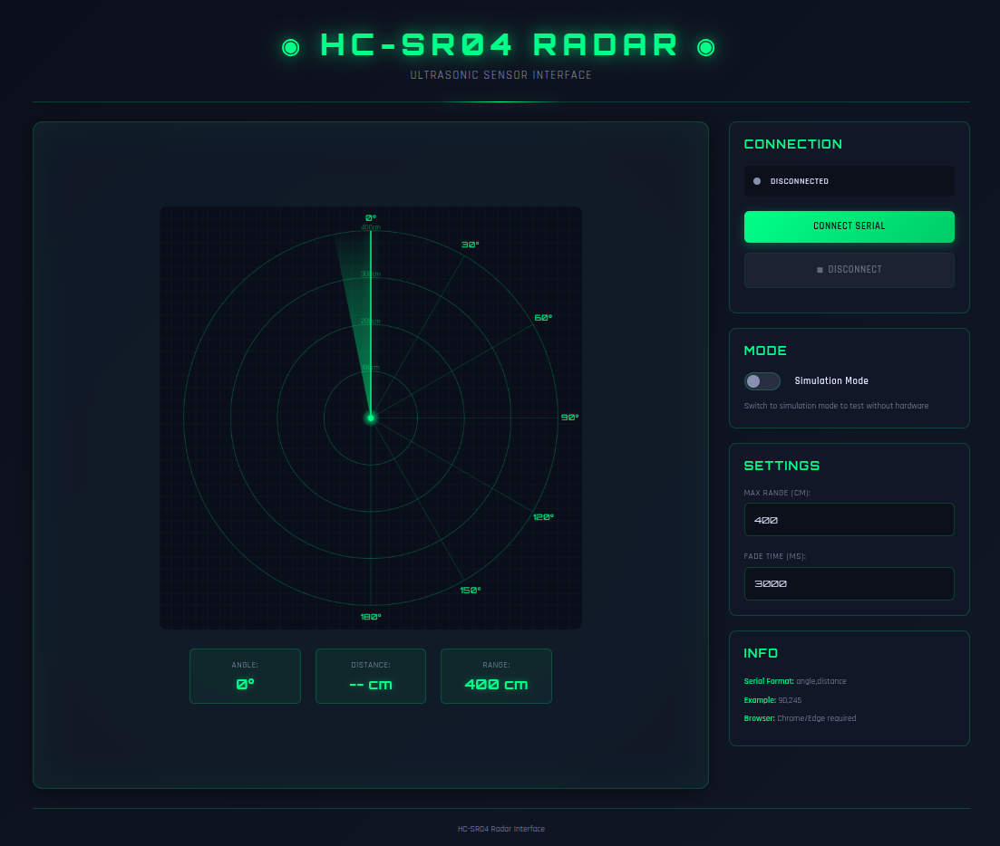

# HC-SR04 Radar Interface

A streamlined web-based interface for visualizing HC-SR04 ultrasonic sensor data in a military-style radar display.

---

## Prerequisites

* **Hardware**: Arduino (Uno/Nano/Mega/ESP32), HC-SR04 sensor, servo motor.
* **Browser**: Chrome, Edge, or Opera (Web Serial API support required).
* **Environment**: Localhost or HTTPS.

## Quick Start

1. **Navigate to project folder**:
```bash
cd radar

```

2. **Launch local server**:
```bash
python3 -m http.server 8000

```

3. **Open Browser**:
Go to `http://localhost:8000`.

## Arduino Configuration

Upload this sketch to your board. Ensure the serial output follows the `angle,distance` format.

```cpp
#include <Servo.h>

#define TRIG_PIN 9
#define ECHO_PIN 10
#define SERVO_PIN 11

Servo servo;
int angle = 0;
int direction = 1;

void setup() {
  Serial.begin(9600);
  pinMode(TRIG_PIN, OUTPUT);
  pinMode(ECHO_PIN, INPUT);
  servo.attach(SERVO_PIN);
}

void loop() {
  servo.write(angle);
  delay(30);
  
  digitalWrite(TRIG_PIN, LOW);
  delayMicroseconds(2);
  digitalWrite(TRIG_PIN, HIGH);
  delayMicroseconds(10);
  digitalWrite(TRIG_PIN, LOW);
  
  long duration = pulseIn(ECHO_PIN, HIGH, 30000);
  long distance = duration * 0.034 / 2;
  
  // Format: angle,distance
  Serial.print(angle);
  Serial.print(",");
  Serial.println(distance);
  
  angle += direction;
  if (angle >= 180 || angle <= 0) direction *= -1;
}

```

## Technical Specifications

* **Baudrate**: 9600
* **Data Format**: `int,int` (e.g., `90,45`)
* **Core Tech**: HTML5 Canvas, Web Serial API, Vanilla JavaScript.

## Troubleshooting

* **Port Busy**: Close the Arduino IDE Serial Monitor before connecting via browser.
* **Unsupported Browser**: Firefox and Safari do not support Web Serial API. Use a Chromium-based browser.
* **No Data**: Verify the serial output is strictly `angle,distance` with no additional text or headers.

---



---
